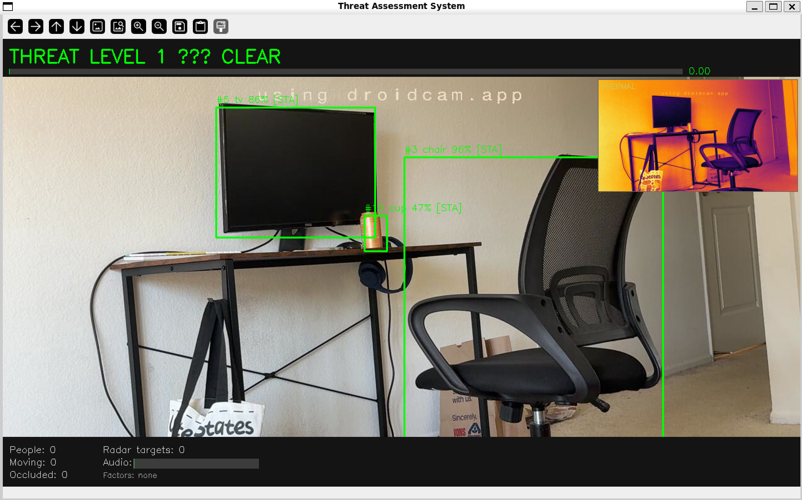

# ROS2 Multi-Modal Threat Assessment System

A 10-node ROS2 perception pipeline combining optical, thermal, radar, and audio 
sensor streams into a real-time fused threat-level estimator with live dashboard.

Built as a demonstration of multi-sensor fusion architecture inspired by 
autonomous drone perception systems.



## System Architecture

| Node | Topic Published | Description |
|------|----------------|-------------|
| `camera_node` | `/camera/image_raw` | Streams phone camera at 30 FPS via MJPEG |
| `thermal_node` | `/thermal/image` | Simulates FLIR thermal output with noise model |
| `radar_node` | `/radar/targets` | Simulates mmWave radar using optical flow + Doppler velocity |
| `audio_node` | `/audio/energy`, `/audio/voice_detected` | Live microphone RMS energy + VAD |
| `detector_node` | `/detections/objects` | YOLOv8-nano object detection at ~25 FPS |
| `tracker_node` | `/tracker/tracks` | Multi-hypothesis tracker with persistent IDs + occlusion detection |
| `fusion_node` | `/fusion/scene` | Weighted multi-modal sensor fusion |
| `threat_node` | `/threat/level` | Converts fused score to threat level 1-5 |
| `dashboard_node` | — | Live OpenCV dashboard with thermal PIP, bounding boxes, HUD |
| `logger_node` | — | CSV session logging with timestamps |

## Sensor Fusion Logic

The fusion node combines all streams into a single threat score (0.0 - 1.0):

- Person detected via YOLO → +0.20
- Person moving (tracked across frames) → +0.20
- Multiple people → +0.15 per additional person
- Occlusion event (MHT track lost) → +0.15
- Fast radar target detected → +0.15
- Loud audio (RMS > 2000) → +0.20
- Voice detected (VAD) → +0.10

## Threat Levels

| Level | Label | Score Range |
|-------|-------|-------------|
| 1 | CLEAR | 0.0 - 0.2 |
| 2 | LOW | 0.2 - 0.4 |
| 3 | MODERATE | 0.4 - 0.6 |
| 4 | HIGH | 0.6 - 0.8 |
| 5 | CRITICAL | 0.8 - 1.0 |

## Tech Stack

- ROS2 Jazzy (Ubuntu 24.04)
- Python 3.12
- YOLOv8-nano (Ultralytics)
- OpenCV 4.6
- PyAudio
- NumPy

## Setup
```bash
# clone
git clone https://github.com/yourusername/ros2-threat-assessment.git
cd ros2-threat-assessment

# install ROS2 Jazzy
sudo apt install ros-jazzy-desktop python3-colcon-common-extensions

# install Python deps
pip3 install ultralytics numpy pyaudio --break-system-packages
sudo apt install python3-opencv ros-jazzy-cv-bridge portaudio19-dev

# build
colcon build
source install/setup.bash
```

## Running

Open a terminal for each node:
```bash
ros2 run threat_system camera_node
ros2 run threat_system thermal_node
ros2 run threat_system radar_node
ros2 run threat_system audio_node
ros2 run threat_system detector_node
ros2 run threat_system tracker_node
ros2 run threat_system fusion_node
ros2 run threat_system threat_node
ros2 run threat_system dashboard_node
ros2 run threat_system logger_node
```

## Camera Setup

Tested with DroidCam (iPhone) over WiFi. Update `PHONE_STREAM_URL` 
in `camera_node.py` to match your stream address.